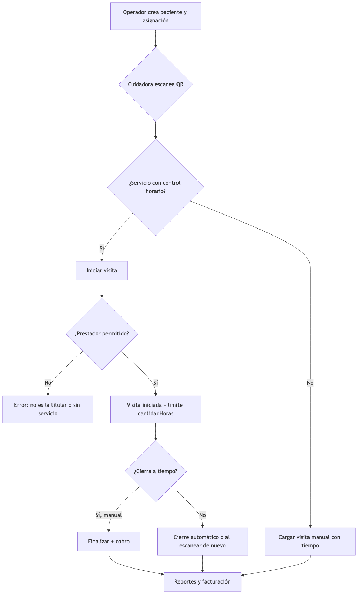

# Flujo de visitas domiciliarias

**Medicine — resumen operativo (asignación → QR → visita → cobro)**

## Diagrama principal

## Piezas del sistema

| Concepto | Qué es |
| -------- | ------ |
| **Paciente** | Persona atendida en domicilio. Tiene código QR. |
| **Asignación** | Autorización: servicio, horas (cantidadHoras), cupo, cuidadora titular (opcional), vigencia. |
| **Visita** | Turno concreto: quién fue, cuándo, cuánto duró, cuánto se cobra. |
| **Control horario** | Doble escaneo QR: iniciar al llegar, finalizar al irse. |

## Casos frecuentes

| Situación | Qué hace el sistema hoy |
| --------- | ----------------------- |
| Turno normal (8 h, cierra a tiempo) | Inicio → fin manual → cobro según tarifa. |
| Olvidó cerrar la visita | Cierre automático al llegar cantidadHoras; respaldo al escanear QR o cron. |
| Cierra tarde (más horas de las autorizadas) | Factura como máximo las horas de la asignación. |
| Suplencia (María no va, va Matilde) | Si la asignación fija a María, Matilde no puede iniciar. Operador debe cambiar prestador en la asignación o usar asignación sin titular fijo. |
| Cupo del día agotado | No permite otra visita en ese período (excepto modalidad por hora). |

## Idea clave para reuniones

- Una visita no es solo “fue la cuidadora”: es **quién fue** + **bajo qué asignación** (horas y reglas de cobro).
- Las horas del cierre automático salen de la **asignación usada**, no de otra cuidadora que suplante.
- Cambios de persona en el día: definir si los resuelve **operaciones** (hoy) o si se necesita módulo de suplencias (futuro).

---

*Documento interno — Medicine Back*
